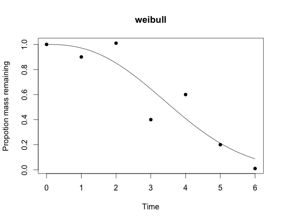
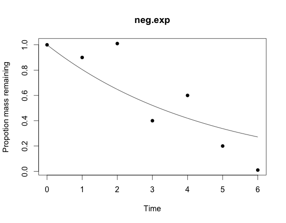

litterFitter
============

Package for fitting and testing alternative models for single cohort litter decomposition data

To install run:

```r
	install.packages("devtools")
	devtools::install_github("cornwell-lab-unsw/litterFitter")
	library(litterFitter)
```

At the moment there is only really one useful function which is `litterFitter` which can fit 6 different types of decomposition trajectories.  

Try:

```r
fit<-litterFitter(time=c(0,1,2,3,4,5,6),mass.remaining=c(1,0.9,1.01,0.4,0.6,0.2,0.01),model="weibull",iters=1000)
```

Then you can do some (useful but limited) things with the `litFit` object like:

```r
plot(fit)
```




`summary(fit)` is also useful

```r
Summary of litFit object
Model type: neg.exp 
Number of observations:  7 
AIC:  -0.792 
AICc:  0.008 
BIC:  -0.8461 
```


