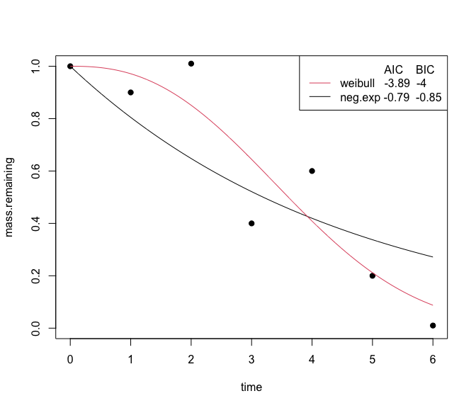
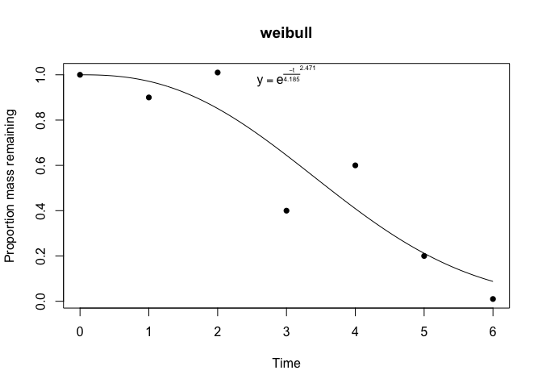
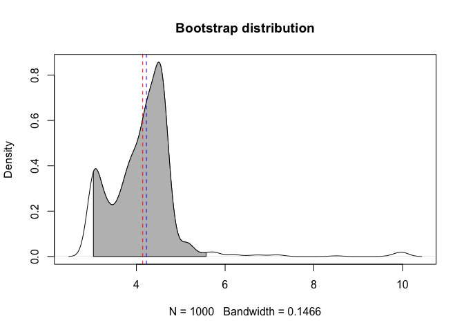

<!-- README.md is generated from README.Rmd. Please edit that file -->

# litterfitter 

> R package for fitting and testing alternative models for single cohort
> litter decomposition data

<!-- badges: start -->

[](https://github.com/cornwell-lab-unsw/litterfitter/actions/workflows/R-CMD-check.yaml)
[](https://app.codecov.io/gh/cornwell-lab-unsw/litterfitter?branch=master)
[](https://doi.org/10.1111/2041-210X.12138)
[](https://cran.r-project.org/package=litterfitter)
<!-- badges: end -->

### Installation

``` r
  #install.packages("remotes")
  remotes::install_github("cornwell-lab-unsw/litterfitter")
  
library(litterfitter)
```

### Getting started

At the moment there is one key function which is `fit_litter` which can
fit 6 different types of decomposition trajectories. Note that the
fitted object is a `litfit` object

``` r
fit <- fit_litter(time=c(0,1,2,3,4,5,6),
                  mass.remaining =c(1,0.9,1.01,0.4,0.6,0.2,0.01),
                  model="weibull",
                  iters=500)

class(fit)
```

You can visually compare the fits of different non-linear equations with
the `plot_multiple_fits` function:

``` r
plot_multiple_fits(time=c(0,1,2,3,4,5,6),
                   mass.remaining=c(1,0.9,1.01,0.4,0.6,0.2,0.01),
                   model=c("neg.exp","weibull"),
                   iters=500)
```



Calling `plot` on a `litfit` object will show you the data, the curve
fit, and even the equation, with the estimated coefficients:

``` r
   plot(fit)
```



The summary of a `litfit` object will show you some of the summary
statistics for the fit.

    #> Summary of litFit object
    #> Model type: weibull 
    #> Number of observations:  7 
    #> Parameter fits: 4.19 
    #> Parameter fits: 2.47 
    #> Time to 50% mass loss: 3.61 
    #> Implied steady state litter mass: 3.71 in units of yearly input 
    #> AIC:  -3.8883 
    #> AICc:  -0.8883 
    #> BIC:  -3.9965

From the `litfit` object you can then see the uncertainty in the
parameter estimate by bootstrapping


